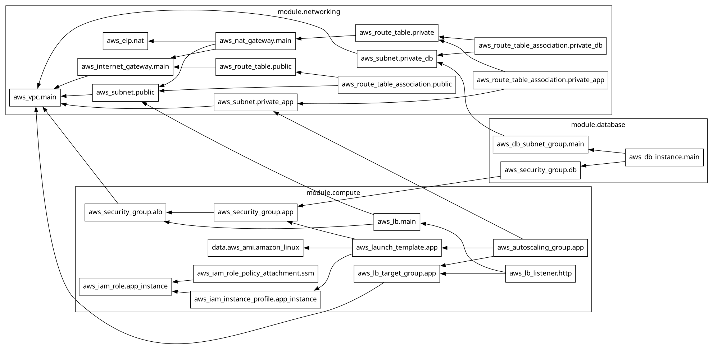

# Three-Tier AWS Infrastructure with Terraform

A production-style, modular three-tier architecture on AWS, built with Terraform. Deploys a public-facing load balancer tier, a private auto-scaled application tier, and an isolated private database tier — with strict security group boundaries enforced between each layer.

## Architecture

    Internet
       |
       v
    [ Internet Gateway ]
       |
       v
    [ Public subnets: ALB, NAT Gateway ]  (2 AZs)
       |
       v
    [ Private subnets: EC2 Auto Scaling Group ]  (2 AZs)
       |
       v
    [ Private subnets: RDS PostgreSQL ]  (2 AZs, isolated)

- **Public tier**: Internet Gateway, Application Load Balancer, NAT Gateway
- **Application tier**: EC2 instances in an Auto Scaling Group, private subnets, only reachable from the ALB
- **Database tier**: RDS PostgreSQL, private subnets, only reachable from the app tier — zero internet exposure

### Terraform resource graph

## Key design decisions

- **Modular Terraform**: separate `networking`, `compute`, and `database` modules, wired together at the root — easy to reuse or extend per environment
- **Remote state**: S3 backend with DynamoDB state locking, versioned and encrypted
- **Least-privilege security groups**: each tier only accepts traffic from the tier directly above it (chained SG references, not CIDR blocks)
- **No SSH keys / no bastion host**: instance access via AWS Systems Manager Session Manager, IAM-controlled instead of network-open ports
- **No plaintext database credentials**: RDS master password generated and stored natively in AWS Secrets Manager, never appears in Terraform state or config
- **IMDSv2 enforced** on all EC2 instances to mitigate SSRF-based credential theft

## Prerequisites

- Terraform >= 1.5.0
- AWS CLI v2, configured with credentials that have permissions for VPC, EC2, RDS, IAM, S3, DynamoDB, and Secrets Manager
- An AWS account

## Setup

1. Create the remote state backend (one-time, manual — see [docs/backend-setup.md](docs/backend-setup.md))
2. Update `backend.tf` with your actual S3 bucket and DynamoDB table names
3. Copy and edit variables:

       cp terraform.tfvars.example terraform.tfvars
       # edit terraform.tfvars with your values

4. Initialize and deploy:

       terraform init
       terraform plan
       terraform apply

## Verifying the deployment

    curl http://$(terraform output -raw alb_dns_name)
    nc -zv -w 5 $(terraform output -raw db_endpoint | cut -d: -f1) 5432

## Teardown

    terraform destroy

This configuration sets `skip_final_snapshot = true` and `deletion_protection = false` on RDS for easy teardown during learning/testing. For production use, both should be reversed.

## Cost awareness

This deploys billable resources — NAT Gateway, ALB, and RDS all incur hourly charges while running. Destroy the stack when not actively using it.

## Project structure

    .
    |-- backend.tf
    |-- providers.tf
    |-- main.tf
    |-- variables.tf
    |-- outputs.tf
    |-- terraform.tfvars.example
    `-- modules/
        |-- networking/   # VPC, subnets, IGW, NAT, route tables
        |-- compute/       # ALB, ASG, launch template, security groups, IAM
        `-- database/      # RDS, DB subnet group, security group
